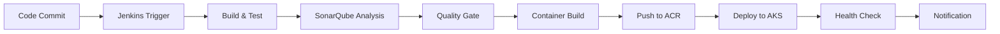

# Jenkins CI/CD Pipeline 구축 가이드

## 📋 개요

phonebill 마이크로서비스를 위한 Jenkins CI/CD 파이프라인 구축 가이드입니다.
Azure Kubernetes Service(AKS)와 Azure Container Registry(ACR)를 활용한 자동화된 배포 시스템을 구성합니다.

## 🏗️ 아키텍처

### 시스템 구성요소
- **Jenkins**: CI/CD 오케스트레이션
- **Azure Container Registry (ACR)**: 컨테이너 이미지 저장소
- **Azure Kubernetes Service (AKS)**: 컨테이너 오케스트레이션
- **SonarQube**: 코드 품질 분석
- **Gradle**: 빌드 도구
- **Kustomize**: Kubernetes 매니페스트 관리

### 배포 환경
- **Development** (`phonebill-dev`)
- **Staging** (`phonebill-staging`)
- **Production** (`phonebill-prod`)

## 🚀 파이프라인 워크플로우



### 주요 단계

1. **Initialize**: 환경별 설정 로드 및 파라미터 설정
2. **Checkout & Prepare**: 소스 코드 체크아웃 및 빌드 태그 생성
3. **Build & Test**: Gradle을 이용한 빌드 및 단위 테스트
4. **SonarQube Analysis**: 코드 품질 분석
5. **Quality Gate**: 품질 기준 검증
6. **Container Build & Push**: 컨테이너 이미지 빌드 및 ACR 푸시
7. **Deploy to Kubernetes**: AKS 클러스터에 배포
8. **Health Check**: 배포된 서비스 상태 확인

## 📂 파일 구조

```
deployment/cicd/
├── Jenkinsfile                           # Jenkins 파이프라인 정의
├── config/
│   ├── deploy_env_vars_dev              # 개발 환경 설정
│   ├── deploy_env_vars_staging          # 스테이징 환경 설정
│   └── deploy_env_vars_prod             # 운영 환경 설정
├── scripts/
│   └── deploy.sh                        # 수동 배포 스크립트
└── jenkins-pipeline-guide.md            # 이 가이드 문서
```

## 🔧 Jenkins 구성

### 1. Jenkins 플러그인 설치

필수 플러그인 목록:
```bash
# Kubernetes 관련
Kubernetes Plugin
Pipeline: Kubernetes Steps

# Azure 관련
Azure CLI Plugin
Azure Container Registry Plugin

# 빌드 도구
Gradle Plugin
Pipeline: Gradle Plugin

# 코드 품질
SonarQube Scanner Plugin
Pipeline: SonarQube Plugin

# 알림
Slack Notification Plugin
Email Extension Plugin

# Git 관련
Git Plugin
GitHub Plugin
Pipeline: GitHub Plugin

# 기타
Pipeline Plugin
Pipeline: Stage View Plugin
Blue Ocean Plugin
```

### 2. 글로벌 설정

#### Azure Service Principal 설정
```bash
# Jenkins 관리 > 시스템 설정 > Global properties
# Environment variables 추가
AZURE_TENANT_ID=<your-tenant-id>
AZURE_SUBSCRIPTION_ID=<your-subscription-id>
```

#### Credentials 설정
Jenkins 관리 > Manage Credentials에서 다음 설정:

1. **azure-service-principal** (Azure Service Principal)
   - ID: `azure-service-principal`
   - Type: Microsoft Azure Service Principal
   - Tenant ID: Azure 테넌트 ID
   - Client ID: 서비스 프린시pal 클라이언트 ID
   - Client Secret: 서비스 프린시pal 시크릿

2. **acr-credentials** (ACR 인증 정보)
   - ID: `acr-credentials`
   - Type: Username with password
   - Username: ACR 사용자명
   - Password: ACR 패스워드

3. **sonarqube-token** (SonarQube 토큰)
   - ID: `sonarqube-token`
   - Type: Secret text
   - Secret: SonarQube 액세스 토큰

4. **slack-token** (Slack 토큰)
   - ID: `slack-token`
   - Type: Secret text
   - Secret: Slack Bot 토큰

### 3. Kubernetes Agent 설정

Jenkins가 Kubernetes 클러스터에서 빌드 에이전트를 실행할 수 있도록 설정:

#### ServiceAccount 및 RBAC 생성
```yaml
# jenkins-rbac.yaml
apiVersion: v1
kind: ServiceAccount
metadata:
  name: jenkins-agent
  namespace: jenkins
---
apiVersion: rbac.authorization.k8s.io/v1
kind: ClusterRole
metadata:
  name: jenkins-agent
rules:
- apiGroups: [\"\"]
  resources: [\"pods\", \"pods/exec\", \"pods/log\", \"persistentvolumeclaims\"]
  verbs: [\"*\"]
- apiGroups: [\"apps\"]
  resources: [\"deployments\", \"replicasets\"]
  verbs: [\"*\"]
---
apiVersion: rbac.authorization.k8s.io/v1
kind: ClusterRoleBinding
metadata:
  name: jenkins-agent
roleRef:
  apiGroup: rbac.authorization.k8s.io
  kind: ClusterRole
  name: jenkins-agent
subjects:
- kind: ServiceAccount
  name: jenkins-agent
  namespace: jenkins
```

#### Gradle Cache PVC 생성
```yaml
# gradle-cache-pvc.yaml
apiVersion: v1
kind: PersistentVolumeClaim
metadata:
  name: jenkins-gradle-cache
  namespace: jenkins
spec:
  accessModes:
    - ReadWriteOnce
  resources:
    requests:
      storage: 10Gi
  storageClassName: managed-premium
```

적용:
```bash
kubectl apply -f jenkins-rbac.yaml
kubectl apply -f gradle-cache-pvc.yaml
```

### 4. SonarQube 설정

#### SonarQube Server 구성
Jenkins 관리 > Configure System > SonarQube servers:
- Name: `SonarQube`
- Server URL: `http://sonarqube.example.com`
- Server authentication token: `sonarqube-token` credential 선택

## 🔨 파이프라인 생성

### 1. 새 Pipeline Job 생성
1. Jenkins 대시보드에서 \"New Item\" 클릭
2. Job 이름: `phonebill-pipeline`
3. Type: \"Pipeline\" 선택
4. OK 클릭

### 2. Pipeline 설정
1. **General** 탭:
   - Description: \"phonebill microservices CI/CD pipeline\"
   - \"GitHub project\" 체크하고 프로젝트 URL 입력

2. **Build Triggers** 탭:
   - \"GitHub hook trigger for GITScm polling\" 체크 (GitHub Webhook 사용 시)
   - \"Poll SCM\" 설정: `H/5 * * * *` (5분마다 폴링)

3. **Pipeline** 탭:
   - Definition: \"Pipeline script from SCM\"
   - SCM: Git
   - Repository URL: GitHub 저장소 URL
   - Credentials: GitHub 인증 정보
   - Branch: `*/main`
   - Script Path: `deployment/cicd/Jenkinsfile`

### 3. 환경별 파이프라인 생성
동일한 방식으로 환경별 파이프라인 생성:
- `phonebill-dev-pipeline`
- `phonebill-staging-pipeline`
- `phonebill-prod-pipeline`

## 🧪 파이프라인 실행

### 1. 수동 실행
1. Jenkins에서 파이프라인 Job 선택
2. \"Build with Parameters\" 클릭
3. 파라미터 설정:
   - **ENVIRONMENT**: `dev` / `staging` / `prod`
   - **SERVICES_TO_BUILD**: `all` 또는 특정 서비스
   - **SKIP_TESTS**: 테스트 스킵 여부
   - **SKIP_SONAR**: SonarQube 분석 스킵 여부
   - **FORCE_DEPLOY**: 강제 배포 여부
4. \"Build\" 클릭

### 2. 자동 실행 (Webhook)
GitHub에서 코드 푸시 시 자동으로 파이프라인이 트리거됩니다.

#### GitHub Webhook 설정
1. GitHub 저장소 > Settings > Webhooks
2. Add webhook:
   - Payload URL: `http://jenkins.example.com/github-webhook/`
   - Content type: `application/json`
   - Secret: 설정한 시크릿
   - Events: \"Just the push event\"

## 📊 모니터링 및 알림

### 1. 빌드 상태 모니터링
- Jenkins Blue Ocean 인터페이스 활용
- 파이프라인 실행 상태 실시간 확인
- 로그 및 아티팩트 확인

### 2. 알림 설정
파이프라인 실행 결과를 다음 채널로 알림:
- **Slack**: 지정된 채널에 빌드 상태 알림
- **Email**: 담당자에게 결과 메일 발송

### 3. 메트릭 수집
- 빌드 시간 추적
- 성공/실패율 모니터링
- 배포 빈도 측정

## 🔍 트러블슈팅

### 일반적인 문제 해결

#### 1. Azure 인증 실패
```bash
# 서비스 프린시pal 권한 확인
az role assignment list --assignee <service-principal-client-id>

# 필요한 권한 할당
az role assignment create \
  --assignee <service-principal-client-id> \
  --role \"AKS Cluster Admin\" \
  --scope /subscriptions/<subscription-id>/resourceGroups/<rg-name>
```

#### 2. ACR 푸시 실패
```bash
# ACR 로그인 확인
az acr login --name <acr-name>

# ACR 권한 확인
az acr show --name <acr-name> --resource-group <rg-name>
```

#### 3. Kubernetes 배포 실패
```bash
# kubectl 컨텍스트 확인
kubectl config current-context

# 네임스페이스 확인
kubectl get namespaces

# 리소스 상태 확인
kubectl get all -n <namespace>
```

#### 4. 파드 시작 실패
```bash
# 파드 로그 확인
kubectl logs <pod-name> -n <namespace>

# 파드 상세 정보 확인
kubectl describe pod <pod-name> -n <namespace>

# 이벤트 확인
kubectl get events -n <namespace> --sort-by='.lastTimestamp'
```

### 로그 위치
- **Jenkins 로그**: `/var/log/jenkins/jenkins.log`
- **파이프라인 로그**: Jenkins UI에서 Build History > Console Output
- **Kubernetes 로그**: `kubectl logs` 명령어 사용

## 🚀 수동 배포 스크립트 사용법

Jenkins 파이프라인 외에도 수동 배포 스크립트를 제공합니다.

### 기본 사용법
```bash
# 모든 서비스를 dev 환경에 배포
./deployment/cicd/scripts/deploy.sh dev

# 특정 서비스만 staging 환경에 배포
./deployment/cicd/scripts/deploy.sh staging user-service

# 여러 서비스를 prod 환경에 배포
./deployment/cicd/scripts/deploy.sh prod api-gateway,user-service,bill-service

# 옵션 사용 예시
./deployment/cicd/scripts/deploy.sh dev all --skip-build --skip-test
```

### 주요 옵션
- `--skip-build`: Gradle 빌드 스킵
- `--skip-test`: 단위 테스트 스킵
- `--skip-push`: 컨테이너 이미지 푸시 스킵
- `--force`: 변경사항이 없어도 강제 배포
- `--dry-run`: 실제 배포 없이 미리보기

## 📈 성능 최적화

### 1. 빌드 성능 개선
- **Gradle Daemon** 활용: `--daemon` 옵션
- **병렬 빌드**: `--parallel` 옵션
- **Build Cache** 활용: `--build-cache` 옵션
- **Incremental Build** 활용

### 2. 컨테이너 이미지 최적화
- **Multi-stage Build** 사용
- **Layer Caching** 최적화
- **Base Image** 최적화
- **.dockerignore** 활용

### 3. Kubernetes 배포 최적화
- **Rolling Update** 전략 사용
- **Resource Limits** 설정
- **Readiness/Liveness Probe** 설정
- **Pod Disruption Budget** 설정

## 🔒 보안 고려사항

### 1. 인증 및 권한 관리
- Azure Service Principal 최소 권한 원칙
- Jenkins Credentials 암호화 저장
- Kubernetes RBAC 적절한 권한 할당
- 시크릿 정보 환경 변수로 분리

### 2. 컨테이너 보안
- 취약점 스캐닝 도구 통합
- 비특권 사용자로 컨테이너 실행
- 읽기 전용 루트 파일시스템
- 보안 컨텍스트 설정

### 3. 네트워크 보안
- Private Registry 사용
- Network Policy 적용
- Service Mesh 보안 정책
- TLS/SSL 암호화

## 📚 참고 자료

### 공식 문서
- [Jenkins Pipeline](https://jenkins.io/doc/book/pipeline/)
- [Azure Kubernetes Service](https://docs.microsoft.com/en-us/azure/aks/)
- [Azure Container Registry](https://docs.microsoft.com/en-us/azure/container-registry/)
- [Kubernetes](https://kubernetes.io/docs/)
- [Gradle](https://docs.gradle.org/)

### 모범 사례
- [Jenkins Best Practices](https://wiki.jenkins.io/display/JENKINS/Jenkins+Best+Practices)
- [Kubernetes Best Practices](https://kubernetes.io/docs/concepts/configuration/overview/)
- [Docker Best Practices](https://docs.docker.com/develop/dev-best-practices/)

## 📞 지원

문제가 발생하거나 추가 지원이 필요한 경우:

1. **로그 확인**: Jenkins 콘솔 출력 및 Kubernetes 로그 검토
2. **문서 검토**: 이 가이드 및 공식 문서 참조
3. **커뮤니티**: Stack Overflow, Jenkins 커뮤니티 포럼 활용
4. **팀 지원**: DevOps 팀 또는 플랫폼 팀에 문의

---

*이 가이드는 phonebill 프로젝트의 Jenkins CI/CD 파이프라인 구축을 위한 완전한 가이드입니다. 프로젝트 요구사항에 따라 설정을 조정하여 사용하시기 바랍니다.*