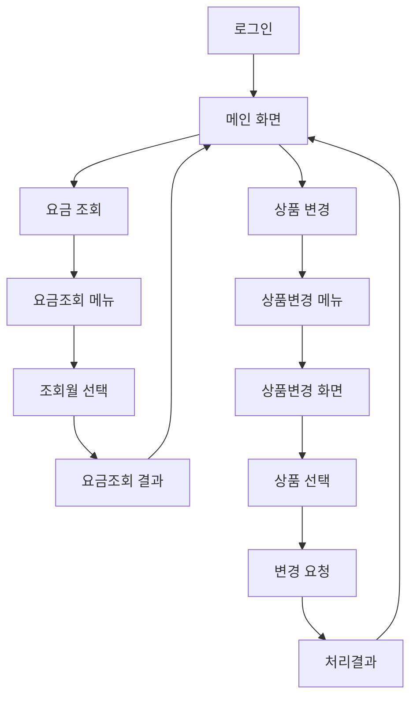
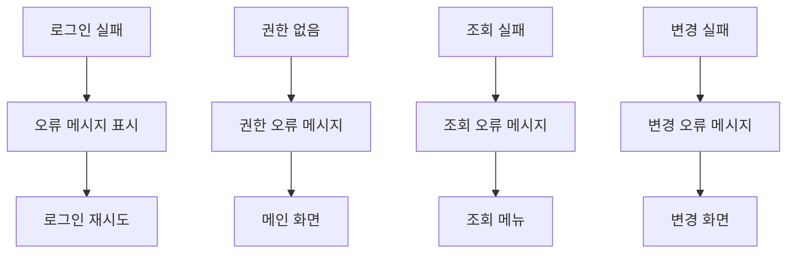

# 통신요금 관리 서비스 - UI/UX 설계서

- [통신요금 관리 서비스 - UI/UX 설계서](#통신요금-관리-서비스---uiux-설계서)
  - [프로젝트 개요](#프로젝트-개요)
  - [정보 아키텍처](#정보-아키텍처)
  - [프로토타입 화면 목록](#프로토타입-화면-목록)
  - [사용자 플로우](#사용자-플로우)
  - [화면별 상세 설계](#화면별-상세-설계)
  - [화면간 전환 및 네비게이션](#화면간-전환-및-네비게이션)
  - [반응형 설계 전략](#반응형-설계-전략)
  - [접근성 보장 방안](#접근성-보장-방안)
  - [성능 최적화 방안](#성능-최적화-방안)
  - [변경 이력](#변경-이력)

---

## 프로젝트 개요

### 서비스 목적
MVNO 고객의 통신요금 조회 및 상품변경을 지원하는 웹 서비스

### 주요 기능
1. **사용자 인증**: 안전한 로그인/로그아웃
2. **요금 조회**: 월별 통신요금 조회
3. **상품 변경**: 요금제 변경 요청 및 처리

### 설계 기준
- **유저스토리 기반**: 총 10개 유저스토리 100% 반영
- **B2C 웹 서비스**: 일반 고객 대상
- **보안 우선**: 개인정보 및 금융정보 보호
- **사용성 중심**: 직관적이고 간단한 UI/UX

---

## 정보 아키텍처

### 서비스 구조
```
통신요금 관리 서비스
├── 인증 영역
│   ├── 로그인
│   └── 권한 확인
├── 요금 조회 영역
│   ├── 조회 메뉴
│   ├── 조회 신청
│   └── 조회 결과
└── 상품 변경 영역
    ├── 변경 메뉴
    ├── 변경 화면
    ├── 변경 요청
    └── 처리 결과
```

### 네비게이션 구조
```
메인 화면
├── 요금 조회 메뉴 → 요금 조회 신청 → 조회 결과
└── 상품 변경 메뉴 → 상품 변경 화면 → 변경 요청 → 처리 결과
```

---

## 프로토타입 화면 목록

| 화면 ID | 화면명 | 관련 유저스토리 | 우선순위 |
|---------|--------|-----------------|----------|
| SCR-001 | 로그인 | UFR-AUTH-010 | M |
| SCR-002 | 메인 화면 | UFR-AUTH-020 | M |
| SCR-003 | 요금조회 메뉴 | UFR-BILL-010 | M |
| SCR-004 | 요금조회 결과 | UFR-BILL-020, UFR-BILL-030, UFR-BILL-040 | M |
| SCR-005 | 상품변경 메뉴 | UFR-PROD-010 | M |
| SCR-006 | 상품변경 화면 | UFR-PROD-020 | M |
| SCR-007 | 상품변경 요청 | UFR-PROD-030 | M |
| SCR-008 | 처리결과 화면 | UFR-PROD-040 | M |

---

## 사용자 플로우

### 메인 플로우


### 오류 처리 플로우


---

## 화면별 상세 설계

### SCR-001: 로그인
**개요**
- 목적: 사용자 인증 및 서비스 접근
- 관련 유저스토리: UFR-AUTH-010
- 비즈니스 중요도: M/5

**주요 기능**
- ID/Password 입력
- 자동 로그인 옵션
- 로그인 버튼
- 오류 메시지 표시

**UI 구성요소**
```
Header
├── 서비스 로고
└── 서비스 제목

Main Content
├── 로그인 폼
│   ├── ID 입력 필드 (required)
│   ├── Password 입력 필드 (required, type=password)
│   ├── 자동 로그인 체크박스
│   └── 로그인 버튼 (primary)
└── 오류 메시지 영역

Footer
└── 저작권 정보
```

**인터랙션**
- ID/Password 유효성 검사 (실시간)
- 로그인 버튼 활성화/비활성화
- 5회 실패 시 계정 잠금 안내
- 성공 시 메인 화면 이동

---

### SCR-002: 메인 화면
**개요**
- 목적: 서비스 메뉴 제공 및 권한별 접근 제어
- 관련 유저스토리: UFR-AUTH-020
- 비즈니스 중요도: M/3

**주요 기능**
- 사용자 정보 표시 (회선번호)
- 서비스 메뉴 제공
- 권한별 메뉴 표시/숨김

**UI 구성요소**
```
Header
├── 서비스 로고
├── 사용자 정보 (회선번호)
└── 로그아웃 버튼

Main Content
├── 환영 메시지
└── 서비스 메뉴 그리드
    ├── 요금 조회 카드 (권한 확인)
    └── 상품 변경 카드 (권한 확인)

Footer
└── 저작권 정보
```

**인터랙션**
- 권한 확인 후 메뉴 표시
- 권한 없는 메뉴는 비활성화 또는 숨김
- 카드 호버 효과
- 카드 클릭 시 해당 서비스로 이동

---

### SCR-003: 요금조회 메뉴
**개요**
- 목적: 요금 조회 옵션 제공
- 관련 유저스토리: UFR-BILL-010
- 비즈니스 중요도: M/5

**주요 기능**
- 회선번호 표시
- 조회월 선택 옵션
- 조회 신청 기능

**UI 구성요소**
```
Header
├── 뒤로가기 버튼
└── 페이지 제목 "요금 조회"

Main Content
├── 고객 정보 섹션
│   └── 회선번호 표시
├── 조회 옵션 섹션
│   ├── 조회월 선택 (드롭다운)
│   │   ├── 기본값: "현재 월"
│   │   └── 이전 6개월 옵션
│   └── 안내 텍스트
└── 액션 버튼 그룹
    ├── 조회 버튼 (primary)
    └── 취소 버튼 (secondary)
```

**인터랙션**
- 조회월 드롭다운 선택
- 조회 버튼 클릭 시 로딩 상태
- 오류 시 에러 메시지 표시

---

### SCR-004: 요금조회 결과
**개요**
- 목적: 조회된 요금 정보 표시
- 관련 유저스토리: UFR-BILL-020, UFR-BILL-030, UFR-BILL-040
- 비즈니스 중요도: M/8, M/13, M/8

**주요 기능**
- 요금 정보 상세 표시
- 사용량 정보 제공
- 새로운 조회 기능

**UI 구성요소**
```
Header
├── 뒤로가기 버튼
└── 페이지 제목 "요금 조회 결과"

Main Content
├── 요금 정보 카드
│   ├── 청구월
│   ├── 상품명 (요금제)
│   ├── 총 요금 (강조 표시)
│   ├── 할인 정보
│   └── 약정 정보
├── 사용량 정보 카드
│   ├── 통화 사용량
│   ├── 데이터 사용량
│   └── SMS 사용량
├── 부가 정보 카드
│   ├── 단말기 할부금
│   ├── 예상 해지비용
│   └── 청구/납부 정보
└── 액션 버튼 그룹
    ├── 다른 월 조회 버튼
    └── 메인으로 버튼
```

**인터랙션**
- 정보 카드 접기/펼치기
- 다른 월 조회 클릭 시 조회 메뉴로 이동
- 로딩 중 스켈레톤 UI 표시

---

### SCR-005: 상품변경 메뉴
**개요**
- 목적: 상품 변경 진입점 제공
- 관련 유저스토리: UFR-PROD-010
- 비즈니스 중요도: M/5

**주요 기능**
- 고객 정보 표시
- 현재 상품 정보 표시
- 상품 변경 화면으로 이동

**UI 구성요소**
```
Header
├── 뒤로가기 버튼
└── 페이지 제목 "상품 변경"

Main Content
├── 고객 정보 카드
│   ├── 회선번호
│   └── 고객ID
├── 현재 상품 정보 카드
│   ├── 상품명
│   ├── 월 기본료
│   └── 주요 혜택
├── 안내 메시지
│   └── 상품 변경 시 주의사항
└── 액션 버튼 그룹
    ├── 상품 변경하기 버튼 (primary)
    └── 취소 버튼 (secondary)
```

**인터랙션**
- 현재 상품 정보 로딩
- 상품 변경하기 클릭 시 변경 화면으로 이동
- 로딩 실패 시 에러 메시지

---

### SCR-006: 상품변경 화면
**개요**
- 목적: 변경 가능한 상품 목록 제공
- 관련 유저스토리: UFR-PROD-020
- 비즈니스 중요도: M/8

**주요 기능**
- 변경 가능한 상품 목록 표시
- 상품 비교 기능
- 상품 선택 기능

**UI 구성요소**
```
Header
├── 뒤로가기 버튼
└── 페이지 제목 "상품 선택"

Main Content
├── 현재 상품 요약 (고정)
├── 상품 목록 섹션
│   └── 상품 카드들
│       ├── 상품명
│       ├── 월 기본료
│       ├── 주요 혜택 리스트
│       ├── 현재 상품과 비교
│       └── 선택 라디오 버튼
└── 액션 버튼 그룹 (고정)
    ├── 선택한 상품으로 변경 (primary, disabled)
    └── 취소 버튼 (secondary)
```

**인터랙션**
- 상품 선택 시 버튼 활성화
- 상품 카드 선택 상태 시각화
- 스크롤 시 헤더와 버튼 고정
- 상품 로딩 중 스켈레톤 표시

---

### SCR-007: 상품변경 요청
**개요**
- 목적: 선택한 상품으로 변경 요청 확인
- 관련 유저스토리: UFR-PROD-030
- 비즈니스 중요도: M/13

**주요 기능**
- 변경 내용 확인
- 사전 체크 진행 상황
- 변경 요청 최종 실행

**UI 구성요소**
```
Header
├── 뒤로가기 버튼
└── 페이지 제목 "상품 변경 요청"

Main Content
├── 변경 내용 확인 카드
│   ├── 현재 상품
│   ├── 변경 화살표 아이콘
│   └── 변경할 상품
├── 주의사항 섹션
│   ├── 변경 시 주의사항
│   ├── 약정/할부 안내
│   └── 요금 변경 안내
├── 진행 상황 표시
│   ├── 사전 체크 진행 바
│   └── 상태 메시지
└── 액션 버튼 그룹
    ├── 변경 신청 버튼 (primary)
    ├── 취소 버튼 (secondary)
    └── 이전 단계 버튼
```

**인터랙션**
- 사전 체크 진행 상태 실시간 업데이트
- 체크 완료 후 변경 신청 버튼 활성화
- 체크 실패 시 오류 메시지 및 재시도 옵션

---

### SCR-008: 처리결과 화면
**개요**
- 목적: 상품 변경 처리 결과 표시
- 관련 유저스토리: UFR-PROD-040
- 비즈니스 중요도: M/21

**주요 기능**
- 처리 결과 상태 표시
- 상세 처리 내용 제공
- 후속 액션 안내

**UI 구성요소**
```
Header
└── 페이지 제목 "처리 결과"

Main Content
├── 결과 상태 카드
│   ├── 성공/실패 아이콘 (대형)
│   ├── 결과 메시지 (제목)
│   └── 상태 설명
├── 처리 내용 카드 (성공 시)
│   ├── 변경된 상품 정보
│   ├── 적용일
│   └── 처리 번호
├── 실패 사유 카드 (실패 시)
│   ├── 실패 원인
│   ├── 해결 방법
│   └── 고객센터 안내
└── 액션 버튼 그룹
    ├── 메인으로 버튼 (primary)
    ├── 다시 시도 버튼 (실패 시)
    └── 고객센터 연결 (실패 시)
```

**인터랙션**
- 결과에 따른 적절한 UI 표시
- 성공/실패 상태별 차별화된 컬러 스킴
- 추가 액션 버튼 제공

---

## 화면간 전환 및 네비게이션

### 네비게이션 패턴
- **계층적 네비게이션**: 뒤로가기 버튼 제공
- **브레드크럼**: 깊이 2단계 이상 시 경로 표시
- **메인 복귀**: 모든 화면에서 홈 버튼 제공

### 전환 효과
- **페이지 전환**: 부드러운 슬라이드 애니메이션 (300ms)
- **모달/팝업**: 페이드 인/아웃 효과 (200ms)
- **로딩 상태**: 스켈레톤 UI 또는 스피너

### URL 구조
```
/ → 로그인 페이지
/main → 메인 화면
/bill/menu → 요금조회 메뉴
/bill/result → 요금조회 결과
/product/menu → 상품변경 메뉴
/product/change → 상품변경 화면
/product/request → 상품변경 요청
/product/result → 처리결과
```

---

## 반응형 설계 전략

### 브레이크포인트
- **Mobile**: ~ 767px
- **Tablet**: 768px ~ 1023px  
- **Desktop**: 1024px ~

### 레이아웃 전략
**Mobile First 설계**
- 기본: 단일 컬럼 레이아웃
- 카드 형태의 콘텐츠 구성
- 터치 친화적 버튼 크기 (44px 이상)

**Tablet**
- 2컬럼 레이아웃 (카드 그리드)
- 사이드바 네비게이션 고려
- 확장된 터치 영역

**Desktop**
- 3컬럼 레이아웃 가능
- 고정 폭 컨테이너 (최대 1200px)
- 호버 상태 적극 활용

### 콘텐츠 우선순위
1. **핵심 정보**: 항상 우선 표시
2. **액션 버튼**: 고정 위치 (하단)
3. **부가 정보**: 접기/펼치기로 제어

---

## 접근성 보장 방안

### WCAG 2.1 AA 수준 준수
**인식 가능성 (Perceivable)**
- 명도 대비 4.5:1 이상 유지
- 대체 텍스트 제공 (모든 이미지)
- 텍스트 크기 조절 가능 (최대 200%)

**운용 가능성 (Operable)**
- 키보드 접근성 완전 지원
- 포커스 순서 논리적 구성
- 자동 재생 콘텐츠 없음

**이해 가능성 (Understandable)**
- 명확한 언어 사용
- 입력 오류 방지 및 수정 지원
- 일관된 네비게이션

**견고성 (Robust)**
- 시맨틱 HTML 사용
- ARIA 라벨 적절히 활용
- 스크린 리더 호환성

### 구체적 구현 사항
- **폼 요소**: 라벨과 입력 필드 명확한 연결
- **버튼**: 명확한 텍스트 또는 aria-label
- **오류 메시지**: 명확한 위치와 해결 방법 안내
- **로딩 상태**: aria-live를 통한 상태 알림

---

## 성능 최적화 방안

### 로딩 성능
**초기 로딩**
- Critical CSS 인라인 처리
- 이미지 지연 로딩 (Lazy Loading)
- 폰트 최적화 (font-display: swap)

**코드 분할**
- 페이지별 번들 분리
- 동적 import 활용
- 트리 쉐이킹 적용

### 런타임 성능
**상태 관리**
- 불필요한 리렌더링 방지
- 메모이제이션 활용
- 가상화 (긴 목록)

**네트워크 최적화**
- API 응답 캐싱
- 요청 중복 제거
- 압축 및 minify

### 사용자 경험
**로딩 상태**
- 스켈레톤 UI 제공
- 프로그레스바 표시
- 오프라인 상태 대응

**오류 처리**
- 명확한 오류 메시지
- 재시도 메커니즘
- 폴백 UI 제공

### 성능 지표 목표
- **First Contentful Paint**: < 1.5초
- **Largest Contentful Paint**: < 2.5초
- **First Input Delay**: < 100ms
- **Cumulative Layout Shift**: < 0.1

---

## 변경 이력

| 버전 | 날짜 | 변경사항 | 작성자 |
|------|------|----------|--------|
| 1.0 | 2025-01-05 | 초기 UI/UX 설계서 작성 | 박화면 |

---

## 검토 사항

### 유저스토리 매칭 검토 ✅
- 총 10개 유저스토리 100% 반영
- 화면별 관련 유저스토리 명시
- 불필요한 추가 설계 없음

### 설계 원칙 준수 ✅
- 통신요금 관리 서비스 특화 설계
- 보안성과 사용성 균형
- 접근성 및 성능 고려