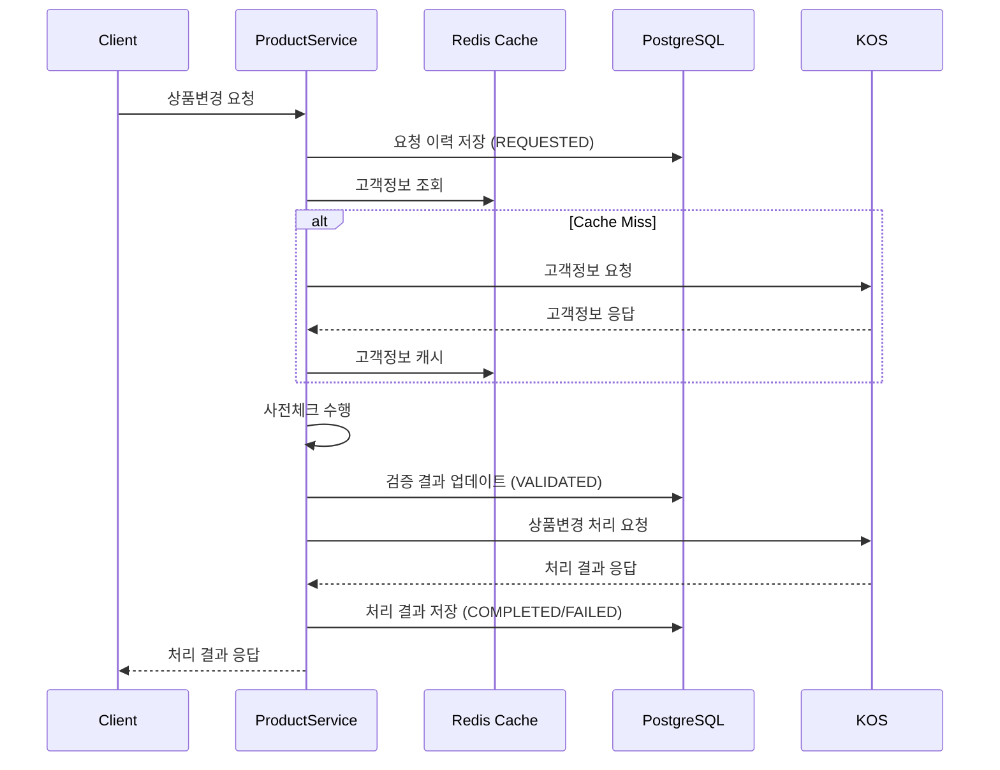

# Product-Change 서비스 데이터 설계서

## 1. 개요

### 1.1 설계 목적
Product-Change 서비스의 상품변경 기능을 위한 독립적인 데이터베이스 설계

### 1.2 설계 원칙
- **서비스 독립성**: Product-Change 서비스만의 전용 데이터베이스
- **데이터 격리**: 다른 서비스와의 직접적인 데이터 의존성 제거
- **캐시 우선**: KOS에서 조회한 고객/상품 정보는 캐시에 저장
- **이력 관리**: 모든 상품변경 요청 및 처리 이력 추적

### 1.3 주요 기능
- UFR-PROD-010: 상품변경 메뉴 접근
- UFR-PROD-020: 상품변경 화면 접근
- UFR-PROD-030: 상품변경 요청 및 사전체크
- UFR-PROD-040: 상품변경 처리 및 이력 관리

## 2. 데이터 설계 전략

### 2.1 서비스 독립성 확보
```yaml
독립성_원칙:
  데이터베이스: product_change_db (전용 데이터베이스)
  스키마: product_change (서비스별 스키마)
  테이블_접두어: pc_ (Product-Change)
  외부_참조: 없음 (캐시를 통한 간접 참조만 허용)
```

### 2.2 캐시 활용 전략
```yaml
캐시_전략:
  고객정보:
    - TTL: 4시간
    - Key: "customer_info:{line_number}"
    - 출처: KOS 고객정보 조회 API
  
  상품정보:
    - TTL: 2시간  
    - Key: "product_info:{product_code}"
    - 출처: KOS 상품정보 조회 API
    
  가용상품목록:
    - TTL: 24시간
    - Key: "available_products:{operator_code}"
    - 출처: KOS 가용상품 조회 API
```

## 3. 테이블 설계

### 3.1 pc_product_change_history (상품변경 이력)
**목적**: 모든 상품변경 요청 및 처리 이력 관리
**Entity 매핑**: ProductChangeHistoryEntity

| 컬럼명 | 데이터타입 | NULL | 기본값 | 설명 |
|--------|-----------|------|--------|------|
| id | BIGSERIAL | NO | | 이력 ID (PK, Auto Increment) |
| request_id | VARCHAR(50) | NO | UUID | 요청 고유 식별자 |
| line_number | VARCHAR(20) | NO | | 회선번호 |
| customer_id | VARCHAR(50) | NO | | 고객 ID |
| current_product_code | VARCHAR(20) | NO | | 변경 전 상품코드 |
| target_product_code | VARCHAR(20) | NO | | 변경 후 상품코드 |
| process_status | VARCHAR(20) | NO | 'REQUESTED' | 처리상태 (REQUESTED/VALIDATED/PROCESSING/COMPLETED/FAILED) |
| validation_result | TEXT | YES | | 사전체크 결과 |
| process_message | TEXT | YES | | 처리 메시지 |
| kos_request_data | JSONB | YES | | KOS 요청 데이터 |
| kos_response_data | JSONB | YES | | KOS 응답 데이터 |
| requested_at | TIMESTAMP | NO | NOW() | 요청 일시 |
| validated_at | TIMESTAMP | YES | | 검증 완료 일시 |
| processed_at | TIMESTAMP | YES | | 처리 완료 일시 |
| created_at | TIMESTAMP | NO | NOW() | 생성 일시 |
| updated_at | TIMESTAMP | NO | NOW() | 수정 일시 |
| version | BIGINT | NO | 0 | 낙관적 락 버전 |

**인덱스**:
- PK: id
- UK: request_id (UNIQUE)
- IDX: line_number, process_status, requested_at
- IDX: customer_id, requested_at

### 3.2 pc_kos_integration_log (KOS 연동 로그)
**목적**: KOS 시스템과의 모든 연동 이력 추적
**용도**: 연동 성능 분석, 오류 추적, 감사

| 컬럼명 | 데이터타입 | NULL | 기본값 | 설명 |
|--------|-----------|------|--------|------|
| id | BIGSERIAL | NO | | 로그 ID (PK) |
| request_id | VARCHAR(50) | YES | | 관련 요청 ID |
| integration_type | VARCHAR(30) | NO | | 연동 유형 (CUSTOMER_INFO/PRODUCT_INFO/PRODUCT_CHANGE) |
| method | VARCHAR(10) | NO | | HTTP 메소드 |
| endpoint_url | VARCHAR(200) | NO | | 호출 엔드포인트 |
| request_headers | JSONB | YES | | 요청 헤더 |
| request_body | JSONB | YES | | 요청 본문 |
| response_status | INTEGER | YES | | HTTP 상태코드 |
| response_headers | JSONB | YES | | 응답 헤더 |
| response_body | JSONB | YES | | 응답 본문 |
| response_time_ms | INTEGER | YES | | 응답 시간(ms) |
| is_success | BOOLEAN | NO | FALSE | 성공 여부 |
| error_message | TEXT | YES | | 오류 메시지 |
| retry_count | INTEGER | NO | 0 | 재시도 횟수 |
| circuit_breaker_state | VARCHAR(20) | YES | | Circuit Breaker 상태 |
| created_at | TIMESTAMP | NO | NOW() | 생성 일시 |

**인덱스**:
- PK: id  
- IDX: request_id, integration_type, created_at
- IDX: is_success, created_at

### 3.3 pc_circuit_breaker_state (Circuit Breaker 상태)
**목적**: Circuit Breaker 패턴의 상태 관리
**용도**: 외부 시스템 장애 시 빠른 실패 처리

| 컬럼명 | 데이터타입 | NULL | 기본값 | 설명 |
|--------|-----------|------|--------|------|
| id | BIGSERIAL | NO | | 상태 ID (PK) |
| service_name | VARCHAR(50) | NO | | 서비스명 (KOS_CUSTOMER/KOS_PRODUCT/KOS_CHANGE) |
| state | VARCHAR(20) | NO | 'CLOSED' | 상태 (CLOSED/OPEN/HALF_OPEN) |
| failure_count | INTEGER | NO | 0 | 연속 실패 횟수 |
| success_count | INTEGER | NO | 0 | 연속 성공 횟수 |
| last_failure_time | TIMESTAMP | YES | | 마지막 실패 시간 |
| next_attempt_time | TIMESTAMP | YES | | 다음 시도 가능 시간 |
| failure_threshold | INTEGER | NO | 5 | 실패 임계값 |
| success_threshold | INTEGER | NO | 3 | 성공 임계값 (Half-Open에서 Closed로) |
| timeout_duration_ms | INTEGER | NO | 60000 | 타임아웃 기간 (ms) |
| updated_at | TIMESTAMP | NO | NOW() | 수정 일시 |

**인덱스**:
- PK: id
- UK: service_name (UNIQUE)

## 4. 도메인 모델과 Entity 매핑

### 4.1 ProductChangeHistoryEntity ↔ ProductChangeHistory
```yaml
매핑_관계:
  Entity: ProductChangeHistoryEntity (JPA Entity)
  Domain: ProductChangeHistory (Domain Model)
  테이블: pc_product_change_history
  
주요_메소드:
  - toDomain(): Entity → Domain 변환
  - fromDomain(): Domain → Entity 변환
  - markAsCompleted(): 완료 상태로 변경
  - markAsFailed(): 실패 상태로 변경
```

### 4.2 캐시된 도메인 모델
```yaml
Product_도메인:
  저장소: Redis Cache
  TTL: 2시간
  키_패턴: "product_info:{product_code}"
  
Customer_정보:
  저장소: Redis Cache  
  TTL: 4시간
  키_패턴: "customer_info:{line_number}"
```

## 5. 데이터 플로우

### 5.1 상품변경 요청 플로우


### 5.2 데이터 동기화 전략
```yaml
실시간_동기화:
  - 상품변경 이력: 즉시 DB 저장
  - 처리 상태 변경: 즉시 반영
  - KOS 연동 로그: 비동기 저장

캐시_무효화:
  - 상품변경 완료 시: 관련 고객/상품 캐시 제거
  - 오류 발생 시: 관련 캐시 유지 (재시도 지원)
```

## 6. 성능 최적화

### 6.1 인덱스 전략
```sql
-- 조회 성능 최적화
CREATE INDEX idx_pc_history_line_status_date 
ON pc_product_change_history(line_number, process_status, requested_at DESC);

-- 고객별 이력 조회
CREATE INDEX idx_pc_history_customer_date 
ON pc_product_change_history(customer_id, requested_at DESC);

-- KOS 연동 로그 조회
CREATE INDEX idx_kos_log_type_success_date 
ON pc_kos_integration_log(integration_type, is_success, created_at DESC);
```

### 6.2 파티셔닝 전략
```yaml
테이블_파티셔닝:
  pc_product_change_history:
    - 파티션 방식: RANGE (requested_at)
    - 파티션 단위: 월별
    - 보존 기간: 24개월
    
  pc_kos_integration_log:
    - 파티션 방식: RANGE (created_at)  
    - 파티션 단위: 월별
    - 보존 기간: 12개월
```

## 7. 데이터 보안

### 7.1 암호화 전략
```yaml
컬럼_암호화:
  민감정보:
    - customer_id: AES-256 암호화
    - 개인식별정보: 해시 처리
    
  연동데이터:
    - kos_request_data: 구조화된 암호화
    - kos_response_data: 선택적 암호화
```

### 7.2 접근 권한
```yaml
데이터베이스_권한:
  app_user:
    - SELECT, INSERT, UPDATE 권한
    - pc_product_change_history 테이블 접근
    
  admin_user:  
    - 전체 테이블 조회 권한
    - 시스템 모니터링용
    
  readonly_user:
    - SELECT 권한만
    - 분석 및 리포팅용
```

## 8. 백업 및 복구

### 8.1 백업 전략
```yaml
백업_정책:
  전체_백업: 매일 02:00 수행
  증분_백업: 6시간마다 수행
  트랜잭션_로그: 실시간 백업
  보존_기간: 30일

복구_시나리오:
  RTO: 4시간 이내
  RPO: 1시간 이내
  복구_우선순위: 상품변경 이력 > KOS 연동 로그
```

## 9. 모니터링 및 알람

### 9.1 모니터링 지표
```yaml
성능_지표:
  - 평균 응답 시간: < 200ms
  - 동시 처리 요청: < 1000 TPS
  - 캐시 적중률: > 80%
  - DB 연결 풀: 사용률 < 70%

비즈니스_지표:
  - 상품변경 성공률: > 95%
  - KOS 연동 성공률: > 98%
  - Circuit Breaker 발동 빈도: < 5회/일
```

### 9.2 알람 설정
```yaml
Critical_알람:
  - DB 연결 실패: 즉시 알람
  - KOS 연동 실패율 > 10%: 5분 내 알람
  - 상품변경 실패율 > 20%: 즉시 알람

Warning_알람:
  - 캐시 적중률 < 70%: 30분 후 알람
  - 응답 시간 > 500ms: 10분 후 알람
  - Circuit Breaker OPEN: 즉시 알람
```

## 10. 관련 파일

- **ERD**: [product-change-erd.puml](./product-change-erd.puml)
- **스키마 스크립트**: [product-change-schema.psql](./product-change-schema.psql)
- **클래스 설계서**: [../class/class.md](../class/class.md)
- **API 설계서**: [../api/product-change-service-api.yaml](../api/product-change-service-api.yaml)

---

**이백개발/백엔더**: Product-Change 서비스의 독립적인 데이터베이스 설계를 완료했습니다. 서비스별 데이터 격리와 캐시를 통한 성능 최적화, 그리고 완전한 이력 추적이 가능한 구조로 설계했습니다.