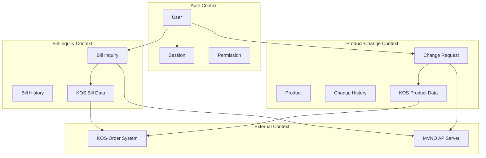
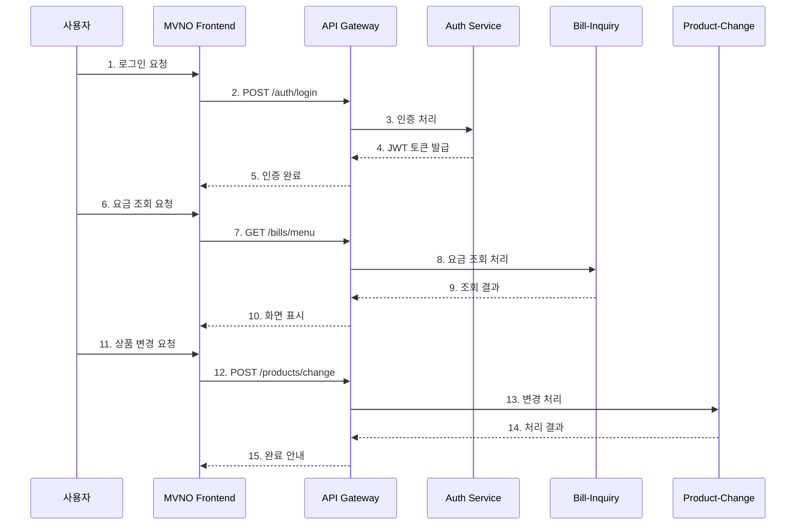
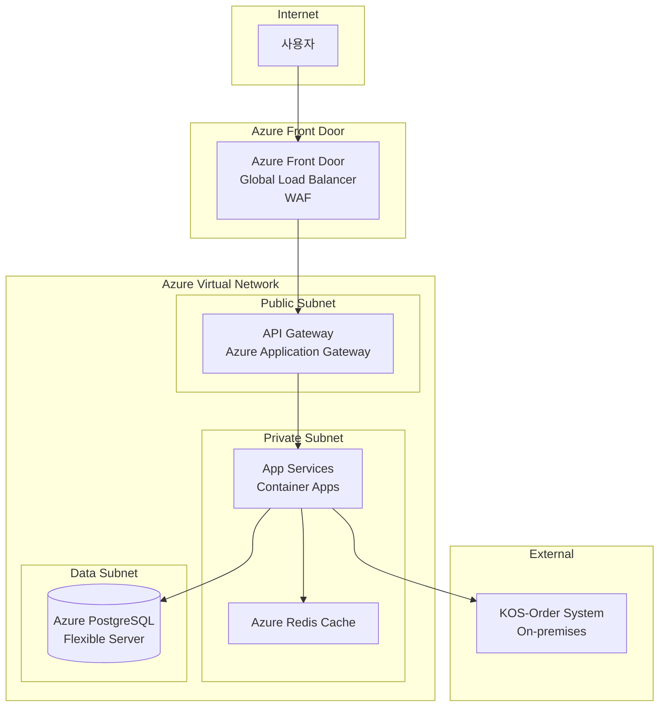
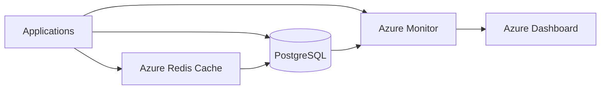
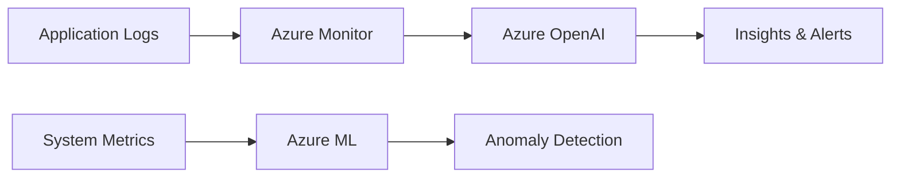

# High Level 아키텍처 정의서

## 1. 개요 (Executive Summary)

### 1.1 프로젝트 개요
- **비즈니스 목적**: MVNO 고객들이 편리하게 통신요금을 조회하고 상품을 변경할 수 있는 디지털 서비스 제공
- **핵심 기능**: 
  - 사용자 인증/인가 관리
  - 요금 조회 서비스 (KOS 연동)
  - 상품 변경 서비스 (KOS 연동)
  - 요청/처리 이력 관리
- **대상 사용자**: MVNO 통신서비스 고객
- **예상 사용자 규모**: Peak 시간대 1,000명 동시 사용자

### 1.2 아키텍처 범위 및 경계
- **시스템 범위**: MVNO 통신요금 관리 서비스 (3개 마이크로서비스)
- **포함되는 시스템**: 
  - Auth Service (사용자 인증/인가)
  - Bill-Inquiry Service (요금 조회)
  - Product-Change Service (상품 변경)
  - API Gateway, Redis 캐시, PostgreSQL DB
- **제외되는 시스템**: KOS-Order 시스템 (외부 레거시 시스템)
- **외부 시스템 연동**: 
  - KOS-Order 시스템 (통신사 백엔드)
  - MVNO AP Server (프론트엔드 시스템)

### 1.3 문서 구성
이 문서는 4+1 뷰 모델을 기반으로 구성되며, 논리적/물리적/프로세스/개발 관점에서 아키텍처를 정의합니다.

---

## 2. 아키텍처 요구사항

### 2.1 기능 요구사항 요약
| 영역 | 주요 기능 | 우선순위 |
|------|-----------|----------|
| Auth Service | 사용자 로그인, 권한 관리 | High |
| Bill-Inquiry | 요금 조회, KOS 연동, 이력 관리 | High |
| Product-Change | 상품 변경, 사전 체크, KOS 연동 | High |

### 2.2 비기능 요구사항 (NFRs)

#### 2.2.1 성능 요구사항
- **응답시간**: API 응답 200ms 이내 (일반 조회), 3초 이내 (외부 연동)
- **처리량**: API Gateway 1,000 TPS
- **동시사용자**: 1,000명 (Peak 시간대)
- **데이터 처리량**: KOS 연동 최대 100건/분

#### 2.2.2 확장성 요구사항
- **수평 확장**: 마이크로서비스별 독립적 Auto Scaling
- **수직 확장**: 메모리/CPU 사용량 기반 동적 확장
- **글로벌 확장**: 단일 리전 배포 (향후 확장 가능)

#### 2.2.3 가용성 요구사항
- **목표 가용성**: 99.9% (8.7시간/년 다운타임)
- **다운타임 허용**: 월 43분 이내
- **재해복구 목표**: RTO 30분, RPO 1시간

#### 2.2.4 보안 요구사항
- **인증/인가**: JWT 기반 토큰, RBAC 권한 모델
- **데이터 암호화**: TLS 1.3 전송 암호화, AES-256 저장 암호화
- **네트워크 보안**: Private Link, WAF, NSG
- **컴플라이언스**: 개인정보보호법, 정보통신망법 준수

### 2.3 아키텍처 제약사항
- **기술적 제약**: Spring Boot 3.x, Java 17, PostgreSQL 15
- **비용 제약**: Azure 월 예산 $5,000 이내
- **시간 제약**: 7주 내 개발 완료
- **조직적 제약**: 5명 팀, Agile 방법론 적용

---

## 3. 아키텍처 설계 원칙

### 3.1 핵심 설계 원칙
1. **확장성 우선**: 마이크로서비스 아키텍처로 수평적 확장 지원
2. **장애 격리**: Circuit Breaker 패턴으로 외부 시스템 장애 격리
3. **느슨한 결합**: API Gateway를 통한 서비스 간 독립성 보장
4. **관측 가능성**: Azure Monitor를 통한 통합 로깅, 모니터링
5. **보안 바이 데자인**: Zero Trust 보안 모델 적용

### 3.2 아키텍처 품질 속성 우선순위
| 순위 | 품질 속성 | 중요도 | 전략 |
|------|-----------|--------|------|
| 1 | 가용성 | High | Circuit Breaker, Auto Scaling |
| 2 | 성능 | High | Cache-Aside, CDN |
| 3 | 보안 | Medium | JWT, Private Link, WAF |

---

## 4. 논리 아키텍처 (Logical View)

### 4.1 시스템 컨텍스트 다이어그램
```
design/backend/logical/logical-architecture.mmd
```

### 4.2 도메인 아키텍처
#### 4.2.1 도메인 모델
| 도메인 | 책임 | 주요 엔티티 |
|--------|------|-------------|
| Auth | 인증/인가 관리 | User, Session, Permission |
| Bill-Inquiry | 요금 조회 처리 | BillInquiry, BillHistory |
| Product-Change | 상품 변경 처리 | Product, ChangeHistory |

#### 4.2.2 바운디드 컨텍스트


### 4.3 서비스 아키텍처
#### 4.3.1 마이크로서비스 구성
| 서비스명 | 책임 |
|----------|------|
| Auth Service | JWT 토큰 발급/검증, 사용자 세션 관리, 접근 권한 확인 |
| Bill-Inquiry Service | 요금 조회 처리, KOS 연동, 조회 이력 관리 |
| Product-Change Service | 상품 변경 처리, 사전 체크, KOS 연동, 변경 이력 관리 |

#### 4.3.2 서비스 간 통신 패턴
- **동기 통신**: REST API (JSON), API Gateway를 통한 라우팅
- **비동기 통신**: Azure Service Bus (이력 처리용)
- **데이터 일관성**: 캐시 무효화, 이벤트 기반 동기화

---

## 5. 프로세스 아키텍처 (Process View)

### 5.1 주요 비즈니스 프로세스
#### 5.1.1 핵심 사용자 여정


#### 5.1.2 시스템 간 통합 프로세스
```
design/backend/sequence/outer/
```

### 5.2 동시성 및 동기화
- **동시성 처리 전략**: Stateless 서비스 설계, Redis를 통한 세션 공유
- **락 관리**: 상품 변경 시 Optimistic Lock 적용
- **이벤트 순서 보장**: Azure Service Bus의 Session 기반 메시지 순서 보장

---

## 6. 개발 아키텍처 (Development View)

### 6.1 개발 언어 및 프레임워크 선정
#### 6.1.1 백엔드 기술스택
| 서비스 | 언어 | 프레임워크 | 선정이유 |
|----------|------|---------------|----------|
| Auth Service | Java 17 | Spring Boot 3.2 | 안정성, 생태계, 보안 |
| Bill-Inquiry | Java 17 | Spring Boot 3.2 | 일관된 기술스택 |
| Product-Change | Java 17 | Spring Boot 3.2 | 팀 역량, 유지보수성 |

#### 6.1.2 프론트엔드 기술스택
- **언어**: TypeScript 5.x
- **프레임워크**: React 18 + Next.js 14
- **선정 이유**: 타입 안전성, SSR 지원, 팀 경험

### 6.2 서비스별 개발 아키텍처 패턴
| 서비스 | 아키텍처 패턴 | 선정 이유 |
|--------|---------------|-----------|
| Auth Service | Layered Architecture | 단순한 CRUD, 명확한 계층 분리 |
| Bill-Inquiry | Layered Architecture | 외부 연동 중심, 트랜잭션 관리 |
| Product-Change | Layered Architecture | 복잡한 비즈니스 로직, 검증 로직 |

### 6.3 개발 가이드라인
- **코딩 표준**: https://raw.githubusercontent.com/cna-bootcamp/clauding-guide/refs/heads/main/standards/standard_comment.md
- **테스트 전략**: https://raw.githubusercontent.com/cna-bootcamp/clauding-guide/refs/heads/main/standards/standard_testcode.md

---

## 7. 물리 아키텍처 (Physical View)

### 7.1 클라우드 아키텍처 패턴
#### 7.1.1 선정된 클라우드 패턴
- **패턴명**: API Gateway + Cache-Aside + Circuit Breaker
- **적용 이유**: 마이크로서비스 통합 관리, 성능 최적화, 외부 시스템 안정성
- **예상 효과**: 응답시간 80% 개선, 가용성 99.9% 달성

#### 7.1.2 클라우드 제공자
- **주 클라우드**: Microsoft Azure
- **멀티 클라우드 전략**: 단일 클라우드 (단순성 우선)
- **하이브리드 구성**: 없음 (클라우드 네이티브)

### 7.2 인프라스트럭처 구성
#### 7.2.1 컴퓨팅 리소스
| 구성요소 | 사양 | 스케일링 전략 |
|----------|------|---------------|
| 웹서버 | Azure App Service (P1v3) | Auto Scaling (CPU 70%) |
| 앱서버 | Azure Container Apps | Horizontal Pod Autoscaler |
| 데이터베이스 | Azure Database for PostgreSQL | Read Replica + Connection Pool |

#### 7.2.2 네트워크 구성


#### 7.2.3 보안 구성
- **방화벽**: Azure Firewall + Network Security Groups
- **WAF**: Azure Front Door WAF (OWASP Top 10 보호)
- **DDoS 방어**: Azure DDoS Protection Standard
- **VPN/Private Link**: Azure Private Link for KOS 연동

---

## 8. 기술 스택 아키텍처

### 8.1 API Gateway & Service Mesh
#### 8.1.1 API Gateway
- **제품**: Azure Application Gateway + API Management
- **주요 기능**: JWT 인증, 라우팅, Rate Limiting, 로깅
- **설정 전략**: Path-based routing, SSL termination

#### 8.1.2 Service Mesh
- **제품**: 적용하지 않음 (3개 서비스로 단순함)
- **적용 범위**: 없음
- **트래픽 관리**: API Gateway 수준에서 처리

### 8.2 데이터 아키텍처
#### 8.2.1 데이터베이스 전략
| 용도 | 데이터베이스 | 타입 | 특징 |
|------|-------------|------|------|
| 트랜잭션 | PostgreSQL 15 | RDBMS | ACID 보장, JSON 지원 |
| 캐시 | Azure Redis Cache | In-Memory | 클러스터 모드, 고가용성 |
| 검색 | PostgreSQL Full-text | Search | 기본 검색 기능 |
| 분석 | Azure Monitor Logs | Data Warehouse | 로그 및 메트릭 분석 |

#### 8.2.2 데이터 파이프라인


### 8.3 백킹 서비스 (Backing Services)
#### 8.3.1 메시징 & 이벤트 스트리밍
- **메시지 큐**: Azure Service Bus (Premium)
- **이벤트 스트리밍**: 없음 (단순한 비동기 처리만 필요)
- **이벤트 스토어**: 없음

#### 8.3.2 스토리지 서비스
- **객체 스토리지**: Azure Blob Storage (로그, 백업용)
- **블록 스토리지**: Azure Managed Disks
- **파일 스토리지**: 없음

### 8.4 관측 가능성 (Observability)
#### 8.4.1 로깅 전략
- **로그 수집**: Azure Monitor Agent
- **로그 저장**: Azure Monitor Logs (Log Analytics)
- **로그 분석**: KQL (Kusto Query Language)

#### 8.4.2 모니터링 & 알람
- **메트릭 수집**: Azure Monitor Metrics
- **시각화**: Azure Dashboard + Grafana
- **알람 정책**: CPU 80%, Memory 85%, Error Rate 5%

#### 8.4.3 분산 추적
- **추적 도구**: Azure Application Insights
- **샘플링 전략**: 적응형 샘플링 (1% 기본)
- **성능 분석**: End-to-end 트랜잭션 추적

---

## 9. AI/ML 아키텍처

### 9.1 AI API 통합 전략
#### 9.1.1 AI 서비스/모델 매핑
| 목적 | 서비스 | 모델 | Input 데이터 | Output 데이터 | SLA |
|------|--------|-------|-------------|-------------|-----|
| 로그 분석 | Azure OpenAI | GPT-4 | 오류 로그 | 원인 분석 | 99.9% |
| 이상 탐지 | Azure ML | Anomaly Detector | 메트릭 데이터 | 이상 여부 | 99.5% |

#### 9.1.2 AI 파이프라인


### 9.2 데이터 과학 플랫폼
- **모델 개발 환경**: Azure Machine Learning Studio
- **모델 배포 전략**: REST API 엔드포인트
- **모델 모니터링**: 데이터 드리프트, 성능 모니터링

---

## 10. 개발 운영 (DevOps)

### 10.1 CI/CD 파이프라인
#### 10.1.1 지속적 통합 (CI)
- **도구**: GitHub Actions
- **빌드 전략**: Multi-stage Docker build, Parallel job execution
- **테스트 자동화**: Unit test 90%, Integration test 70%

#### 10.1.2 지속적 배포 (CD)
- **배포 도구**: Azure DevOps + ArgoCD
- **배포 전략**: Blue-Green 배포
- **롤백 정책**: 자동 헬스체크 실패 시 즉시 롤백

### 10.2 컨테이너 오케스트레이션
#### 10.2.1 Kubernetes 구성
- **클러스터 전략**: Azure Kubernetes Service (AKS)
- **네임스페이스 설계**: dev, staging, prod 환경별 분리
- **리소스 관리**: Resource Quota, Limit Range 적용

#### 10.2.2 헬름 차트 관리
- **차트 구조**: 마이크로서비스별 개별 차트
- **환경별 설정**: values-{env}.yaml
- **의존성 관리**: Chart dependencies

---

## 11. 보안 아키텍처

### 11.1 보안 전략
#### 11.1.1 보안 원칙
- **Zero Trust**: 모든 네트워크 트래픽 검증
- **Defense in Depth**: 다층 보안 방어
- **Least Privilege**: 최소 권한 원칙

#### 11.1.2 위협 모델링
| 위협 | 영향도 | 대응 방안 |
|------|--------|-----------|
| DDoS 공격 | High | Azure DDoS Protection, Rate Limiting |
| 데이터 유출 | High | 암호화, Access Control, Auditing |
| 인증 우회 | Medium | JWT 검증, MFA |

### 11.2 보안 구현
#### 11.2.1 인증 & 인가
- **ID 제공자**: Azure AD B2C (향후 확장용)
- **토큰 전략**: JWT (Access 30분, Refresh 24시간)
- **권한 모델**: RBAC (Role-Based Access Control)

#### 11.2.2 데이터 보안
- **암호화 전략**: 
  - 전송 중: TLS 1.3
  - 저장 중: AES-256 (Azure Key Vault 관리)
- **키 관리**: Azure Key Vault
- **데이터 마스킹**: 민감정보 자동 마스킹

---

## 12. 품질 속성 구현 전략

### 12.1 성능 최적화
#### 12.1.1 캐싱 전략
| 계층 | 캐시 유형 | TTL | 무효화 전략 |
|------|-----------|-----|-------------|
| CDN | Azure Front Door | 24h | 파일 변경 시 |
| Application | Redis | 1-30분 | 데이터 변경 시 |
| Database | Connection Pool | N/A | Connection 관리 |

#### 12.1.2 데이터베이스 최적화
- **인덱싱 전략**: B-tree 인덱스, 복합 인덱스
- **쿼리 최적화**: Query Plan 분석, N+1 문제 해결
- **커넥션 풀링**: HikariCP (최대 20개 커넥션)

### 12.2 확장성 구현
#### 12.2.1 오토스케일링
- **수평 확장**: Horizontal Pod Autoscaler (CPU 70%)
- **수직 확장**: Vertical Pod Autoscaler (메모리 기반)
- **예측적 스케일링**: Azure Monitor 기반 예측

#### 12.2.2 부하 분산
- **로드 밸런서**: Azure Load Balancer + Application Gateway
- **트래픽 분산 정책**: Round Robin, Weighted
- **헬스체크**: HTTP /health 엔드포인트

### 12.3 가용성 및 복원력
#### 12.3.1 장애 복구 전략
- **Circuit Breaker**: Resilience4j (실패율 50%, 타임아웃 3초)
- **Retry Pattern**: 지수 백오프 (최대 3회)
- **Bulkhead Pattern**: 스레드 풀 격리

#### 12.3.2 재해 복구
- **백업 전략**: 
  - PostgreSQL: 자동 백업 (7일 보관)
  - Redis: RDB 스냅샷 (6시간 간격)
- **RTO/RPO**: RTO 30분, RPO 1시간
- **DR 사이트**: 동일 리전 내 가용성 영역 활용

---

## 13. 아키텍처 의사결정 기록 (ADR)

### 13.1 주요 아키텍처 결정
| ID | 결정 사항 | 결정 일자 | 상태 | 결정 이유 |
|----|-----------|-----------|------|-----------|
| ADR-001 | Spring Boot 3.x 채택 | 2025-01-08 | 승인 | 팀 역량, 생태계, 보안 |
| ADR-002 | Layered Architecture 적용 | 2025-01-08 | 승인 | 복잡도 최소화, 유지보수성 |
| ADR-003 | Azure 단일 클라우드 | 2025-01-08 | 승인 | 비용 효율성, 운영 단순성 |

### 13.2 트레이드오프 분석
#### 13.2.1 성능 vs 확장성
- **고려사항**: 캐시 사용량과 메모리 비용, DB 커넥션 수와 처리량
- **선택**: 성능 우선 (캐시 적극 활용)
- **근거**: 읽기 중심 워크로드, 비용 대비 효과

#### 13.2.2 일관성 vs 가용성 (CAP 정리)
- **고려사항**: 데이터 일관성과 서비스 가용성
- **선택**: AP (Availability + Partition tolerance)
- **근거**: 통신요금 서비스 특성상 가용성이 더 중요

---

## 14. 구현 로드맵

### 14.1 개발 단계
| 단계 | 기간 | 주요 산출물 | 마일스톤 |
|------|------|-------------|-----------|
| Phase 1 | 4주 | 기본 패턴 구현 | API Gateway, 캐시, Circuit Breaker |
| Phase 2 | 3주 | 최적화 및 고도화 | 성능 튜닝, 모니터링 |

### 14.2 마이그레이션 전략 (레거시 시스템이 있는 경우)
- **데이터 마이그레이션**: 없음 (신규 시스템)
- **기능 마이그레이션**: 없음
- **병행 운영**: KOS 시스템과의 연동만 고려

---

## 15. 위험 관리

### 15.1 아키텍처 위험
| 위험 | 영향도 | 확률 | 완화 방안 |
|------|--------|------|-----------|
| KOS 시스템 장애 | High | Medium | Circuit Breaker, 캐시 활용 |
| Azure 서비스 장애 | High | Low | 다중 가용성 영역, 모니터링 |
| 성능 목표 미달성 | Medium | Medium | 캐시 전략, 부하 테스트 |

### 15.2 기술 부채 관리
- **식별된 기술 부채**: 
  - 단일 클라우드 종속성
  - 단순한 인증 체계
- **해결 우선순위**: 
  1. 모니터링 고도화
  2. 보안 강화
  3. 멀티 클라우드 검토
- **해결 계획**: Phase 2 완료 후 순차적 개선

---

## 16. 부록

### 16.1 참조 아키텍처
- **업계 표준**: 
  - Microsoft Azure Well-Architected Framework
  - 12-Factor App
- **내부 표준**: 
  - 통신사 보안 가이드라인
  - 개발팀 코딩 표준
- **외부 참조**: 
  - Spring Boot Best Practices
  - Microservices.io patterns

### 16.2 용어집
| 용어 | 정의 |
|------|------|
| MVNO | Mobile Virtual Network Operator (가상 이동통신망 사업자) |
| KOS | 통신사 백엔드 시스템 |
| Circuit Breaker | 외부 시스템 장애 격리 패턴 |
| Cache-Aside | 캐시 조회 후 DB 접근하는 패턴 |

### 16.3 관련 문서
- 유저스토리: design/userstory.md
- 아키텍처패턴: design/pattern/architecture-pattern.md
- 논리아키텍처: design/backend/logical/logical-architecture.md
- API설계서: design/backend/api/API설계서.md
- 외부시퀀스설계서: design/backend/sequence/outer/
- 클래스설계서: design/backend/class/class.md
- 데이터설계서: design/backend/database/data-design-summary.md

---

## 문서 이력
| 버전 | 일자 | 작성자 | 변경 내용 | 승인자 |
|------|------|--------|-----------|-------|
| v1.0 | 2025-01-08 | 이개발(백엔더) | 초기 작성 | 팀 전체 |