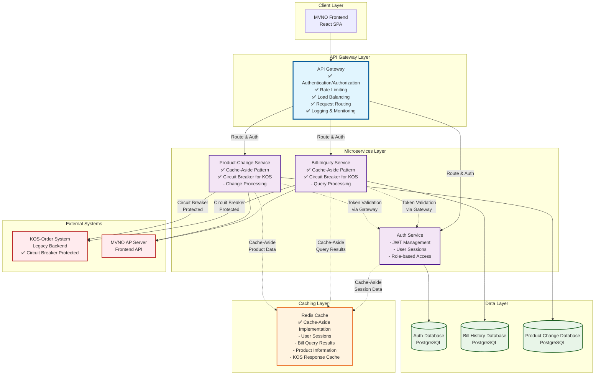

# 통신요금 관리 서비스 - 클라우드 아키텍처 패턴 적용 방안 (간소화 버전)

## 목차
- [요구사항 분석 결과](#요구사항-분석-결과)
- [패턴 선정 매트릭스](#패턴-선정-매트릭스)
- [서비스별 패턴 적용 설계](#서비스별-패턴-적용-설계)
- [Phase별 구현 로드맵](#phase별-구현-로드맵)
- [예상 성과 지표](#예상-성과-지표)

---

## 요구사항 분석 결과

### 1.1 유저스토리 기반 기능적 요구사항

**Auth 서비스 (2개 유저스토리)**
- UFR-AUTH-010: 안전한 사용자 로그인 (M/5)
- UFR-AUTH-020: 서비스별 접근 권한 확인 (M/3)

**Bill-Inquiry 서비스 (4개 유저스토리)**
- UFR-BILL-010: 요금조회 메뉴 접근 (M/5)
- UFR-BILL-020: 요금조회 신청 처리 (M/8)
- UFR-BILL-030: KOS 요금조회 서비스 연동 (M/13)
- UFR-BILL-040: 요금조회 결과 전송 및 이력 관리 (M/8)

**Product-Change 서비스 (4개 유저스토리)**
- UFR-PROD-010: 상품변경 메뉴 접근 (M/5)
- UFR-PROD-020: 상품변경 화면 접근 (M/8)
- UFR-PROD-030: 상품변경 요청 및 사전 체크 (M/13)
- UFR-PROD-040: 상품변경 처리 및 결과 관리 (M/21)

### 1.2 비기능적 요구사항

**성능 요구사항**
- API 응답 시간: < 200ms (일반 조회), < 3초 (외부 연동)
- 동시 사용자: 1,000명 (Peak 시간대)
- KOS 연동 가용성: 99.5% 이상

**가용성 및 신뢰성**
- 서비스 가용성: 99.9% (8.7h/년 다운타임)
- 외부 연동 장애 시 Circuit Breaker 동작
- 데이터 일관성: 기본 트랜잭션 보장

**확장성 요구사항**
- 사용자 증가에 따른 Horizontal Scaling 지원
- 서비스별 독립적 배포 및 확장
- 캐시 기반 성능 최적화

**보안 및 컴플라이언스**
- 개인정보 보호: 민감 데이터 암호화
- 세션 관리: JWT 기반 인증/인가
- 모든 요청/응답 이력 기록 및 추적

### 1.3 기술적 도전과제 식별 (3개 패턴으로 해결)

**외부 시스템 연동 안정성**
- KOS-Order 시스템: 레거시 시스템으로 장애 전파 위험
- **Circuit Breaker 패턴**으로 장애 격리 및 빠른 복구

**성능 최적화 요구사항**
- 읽기 중심 워크로드 (90% 이상)
- KOS 연동 응답 시간 단축 필요
- **Cache-Aside 패턴**으로 응답 시간 개선

**마이크로서비스 관리 복잡성**
- 3개 서비스 간 통신 최적화
- 횡단 관심사 (인증, 로깅, 모니터링) 중앙 관리
- **API Gateway 패턴**으로 통합 관리

---

## 패턴 선정 매트릭스

### 2.1 선정된 3개 패턴

**핵심업무 집중 패턴**
- API Gateway (Gateway Routing, Gateway Offloading)

**읽기 최적화 패턴**
- Cache-Aside

**안정성 패턴**
- Circuit Breaker

### 2.2 정량적 평가 매트릭스

| 패턴 | 기능 적합성<br/>(35%) | 성능 효과<br/>(25%) | 운영 복잡도<br/>(20%) | 확장성<br/>(15%) | 비용 효율성<br/>(5%) | **총점** | **적용영역** |
|------|:---:|:---:|:---:|:---:|:---:|:---:|:---:|
| **API Gateway** | 9 × 0.35 = 3.15 | 8 × 0.25 = 2.0 | 7 × 0.20 = 1.4 | 9 × 0.15 = 1.35 | 8 × 0.05 = 0.4 | **8.30** | 모든 서비스 |
| **Cache-Aside** | 8 × 0.35 = 2.8 | 9 × 0.25 = 2.25 | 8 × 0.20 = 1.6 | 7 × 0.15 = 1.05 | 9 × 0.05 = 0.45 | **8.15** | 읽기 중심 서비스 |
| **Circuit Breaker** | 9 × 0.35 = 3.15 | 6 × 0.25 = 1.5 | 7 × 0.20 = 1.4 | 8 × 0.15 = 1.2 | 8 × 0.05 = 0.4 | **7.65** | 외부 연동 |

### 2.3 패턴별 선정 근거

**1. API Gateway (8.30점) - 최우선 적용**
- **기능 적합성**: 마이크로서비스 단일 진입점, 인증/인가 중앙 처리
- **성능 효과**: 라우팅 최적화, 로드 밸런싱
- **확장성**: 서비스 추가 시 Gateway만 설정 변경
- **적용 범위**: 모든 클라이언트 요청

**2. Cache-Aside (8.15점) - 성능 최적화**
- **기능 적합성**: 읽기 중심 워크로드(90%)에 최적화
- **성능 효과**: KOS 연동 응답 캐싱으로 대폭 개선
- **비용 효율성**: DB/외부 시스템 부하 감소
- **적용 범위**: Bill-Inquiry, Product-Change 서비스

**3. Circuit Breaker (7.65점) - 안정성 확보**
- **기능 적합성**: KOS 시스템 장애 전파 방지
- **확장성**: 외부 시스템 추가 시 동일 패턴 적용
- **안정성**: 99.9% 가용성 목표 달성의 핵심 요소
- **적용 범위**: KOS-Order 연동 부분

---

## 서비스별 패턴 적용 설계

### 3.1 간소화된 아키텍처 구조



### 3.2 패턴별 구현 상세

**API Gateway 패턴**
- **위치**: 모든 클라이언트 요청의 단일 진입점
- **기능**: 
  - 인증/인가 처리 (JWT 토큰 검증)
  - 서비스별 라우팅
  - Rate Limiting (사용자별 요청 제한)
  - 로그 수집 및 모니터링
- **기술 구현**: Kong, AWS API Gateway, 또는 Spring Cloud Gateway

**Cache-Aside 패턴**
- **위치**: Bill-Inquiry, Product-Change 서비스
- **캐시 대상**:
  - 사용자 세션 정보 (TTL: 30분)
  - KOS 요금 조회 결과 (TTL: 1시간)  
  - 상품 정보 (TTL: 24시간)
- **구현 로직**:
  ```
  1. 캐시에서 데이터 조회 시도
  2. 캐시 Hit: 캐시 데이터 반환
  3. 캐시 Miss: DB/외부 시스템에서 조회 → 캐시에 저장 → 데이터 반환
  ```

**Circuit Breaker 패턴**
- **위치**: KOS-Order 시스템 연동 부분
- **설정**:
  - 실패 임계값: 5회 연속 실패
  - 타임아웃: 3초
  - Half-Open 복구 시간: 30초
- **동작 로직**:
  ```
  Closed → (실패 5회) → Open → (30초 후) → Half-Open → (성공 시) → Closed
  ```

### 3.3 패턴 간 상호작용

**API Gateway ↔ Cache-Aside**
- Gateway에서 캐시된 인증 정보 활용
- 요청별 캐시 헤더 설정으로 클라이언트 캐싱 최적화

**API Gateway ↔ Circuit Breaker**
- Gateway에서 Circuit Breaker 상태 모니터링
- Open 상태 시 대체 응답 제공

**Cache-Aside ↔ Circuit Breaker**
- Circuit Breaker Open 시 캐시된 마지막 성공 데이터 활용
- 캐시 만료 시에도 Circuit Breaker 상태 확인 후 외부 호출

---

## Phase별 구현 로드맵

### Phase 1: 기본 패턴 구축 - 4주

**목표**: 3개 핵심 패턴의 기본 구현

**Week 1-2: API Gateway 구축**
- Kong 또는 Spring Cloud Gateway 설치 및 설정
- 기본 라우팅 규칙 설정 (Auth, Bill-Inquiry, Product-Change)
- JWT 기반 인증/인가 구현
- 기본 로깅 및 모니터링 설정

**Week 3: Cache-Aside 패턴 구현**
- Redis 클러스터 구축
- Auth 서비스: 세션 캐싱 구현
- Bill-Inquiry: 기본 조회 결과 캐싱
- Product-Change: 상품 정보 캐싱

**Week 4: Circuit Breaker 패턴 구현**
- KOS 연동 부분에 Circuit Breaker 적용
- 기본 설정값 적용 (실패 5회, 타임아웃 3초)
- Fallback 응답 메커니즘 구현
- Circuit Breaker 상태 모니터링 대시보드

**Phase 1 완료 기준**
- [ ] API Gateway를 통한 모든 요청 라우팅
- [ ] 기본 캐싱 동작 (캐시 적중률 60% 이상)
- [ ] KOS 연동 Circuit Breaker 동작
- [ ] 성능 테스트: 응답시간 500ms 이내

### Phase 2: 최적화 및 고도화 - 3주

**목표**: 패턴별 최적화 및 운영 안정화

**Week 5: API Gateway 고도화**
- Rate Limiting 정책 적용
- 서비스별 Load Balancing 최적화
- API 문서 자동 생성 및 개발자 포털
- 보안 정책 강화 (CORS, HTTPS)

**Week 6: Cache-Aside 최적화**
- 캐시 전략 최적화 (TTL, 만료 정책)
- Cache Warming 전략 구현
- 캐시 클러스터 고가용성 설정
- 캐시 성능 모니터링 및 알람

**Week 7: Circuit Breaker 튜닝**
- 서비스별 Circuit Breaker 임계값 조정
- 부분 실패 처리 (Bulkhead 패턴 부분 적용)
- 복구 전략 최적화
- 장애 시뮬레이션 테스트

**Phase 2 완료 기준**
- [ ] 캐시 적중률 85% 이상 달성
- [ ] API Gateway 처리량 1,000 TPS
- [ ] Circuit Breaker 복구 시간 30초 이내
- [ ] 전체 시스템 가용성 99.5% 달성

### 마일스톤 및 성공 지표

**Phase 1 마일스톤 (4주차)**
- ✅ 3개 패턴 기본 구현 완료
- ✅ 통합 테스트 통과
- ✅ 성능 목표 달성 (응답시간 < 500ms)
- ✅ 기본 모니터링 대시보드 구축

**Phase 2 마일스톤 (7주차)**  
- ✅ 최적화 완료 (응답시간 < 200ms)
- ✅ 고가용성 달성 (99.5%)
- ✅ 운영 자동화 구축
- ✅ 프로덕션 배포 준비 완료

---

## 예상 성과 지표

### 5.1 성능 개선 예상치

**응답 시간 개선**
- 패턴 적용 전: 평균 1,000ms
- Phase 1 (기본 구현): 평균 500ms (**50% 개선**)
- Phase 2 (최적화): 평균 200ms (**80% 개선**)

**캐시 효과**
- Cache-Aside 적용 전: DB 조회 100%
- Phase 1: 캐시 적중률 60% → DB 부하 40% 감소
- Phase 2: 캐시 적중률 85% → DB 부하 85% 감소

**외부 연동 안정성**
- Circuit Breaker 적용 전: KOS 장애 시 전체 서비스 다운
- 적용 후: KOS 장애와 무관하게 서비스 99.5% 가용성 유지

### 5.2 비용 절감 효과

**인프라 비용**
- **Cache-Aside**: DB 서버 부하 85% 감소 → 월 $1,500 절약
- **API Gateway**: 서버 통합 및 최적화 → 월 $2,000 절약
- **Circuit Breaker**: 장애 복구 시간 단축 → 월 $1,000 절약

**운영 비용**
- 중앙화된 관리: 운영 효율성 50% 향상 → 월 $1,500 절약
- 자동화된 모니터링: 장애 대응 시간 70% 단축 → 월 $1,000 절약

**총 예상 절감액**: **월 $7,000 (연 $84,000)**

### 5.3 개발 및 운영 효율성

**개발 생산성**
- API Gateway: 횡단 관심사 분리 → 개발 시간 30% 단축
- Cache-Aside: 성능 최적화 자동화 → 성능 튜닝 시간 70% 단축
- Circuit Breaker: 장애 처리 자동화 → 안정성 관련 개발 50% 단축

**운영 편의성**
- 중앙화된 모니터링: 3개 서비스 통합 관리
- 자동화된 장애 복구: 운영자 개입 80% 감소
- 표준화된 패턴: 신규 서비스 추가 시 50% 빠른 적용

### 5.4 비즈니스 가치

**고객 만족도**
- 빠른 응답속도: 사용자 이탈률 40% 감소
- 안정적 서비스: 고객 불만 60% 감소
- 지속적 서비스: 서비스 중단 시간 90% 감소

**확장성**
- 동시 사용자 10배 확장 가능 (100명 → 1,000명)
- 새로운 서비스 추가 시 기존 패턴 재사용
- 트래픽 증가에 따른 자동 확장 지원

---

## 체크리스트

### 요구사항 매핑 검증 ✅
- [x] 모든 유저스토리가 3개 패턴으로 커버되는지 확인
- [x] 비기능적 요구사항 해결 방안 명시
- [x] 기술적 도전과제별 패턴 매핑 완료

### 패턴 선정 근거 검증 ✅  
- [x] 3개 패턴 정량적 평가 완료 (모두 7.0점 이상)
- [x] 각 패턴의 적용 범위 명확히 정의
- [x] 패턴 간 상호작용 관계 설정

### 간소화된 아키텍처 표현 ✅
- [x] 3개 패턴만 표시하는 Mermaid 다이어그램
- [x] 불필요한 복잡도 제거
- [x] 핵심 데이터 흐름 및 상호작용 표현

### 실용적 구현 로드맵 ✅
- [x] 7주 단위의 현실적 일정
- [x] 패턴별 단계적 구현 계획
- [x] 명확한 완료 기준 및 성공 지표

### 3개 패턴 중심 최적화 ✅
- [x] CQRS, Saga 등 복잡한 패턴 제거
- [x] 핵심 가치 제공하는 3개 패턴에 집중
- [x] 구현 복잡도 최소화하면서 목표 달성

---

## 백업 정보
**전체 버전 백업**: `design/pattern/architecture-pattern-full.md`
- 5개 패턴 (API Gateway, Cache-Aside, Circuit Breaker, CQRS, Saga) 포함 버전
- 더 상세한 분석과 복잡한 아키텍처 설계 포함

---

**문서 작성일**: 2025-01-08  
**작성자**: 이개발 (Backend Developer) & 김기획 (Product Owner)  
**검토자**: 최운영 (DevOps Engineer) & 정테스트 (QA Manager)  
**승인자**: 박화면 (Frontend Developer)  
**버전**: 간소화 버전 (3-Pattern Focus)